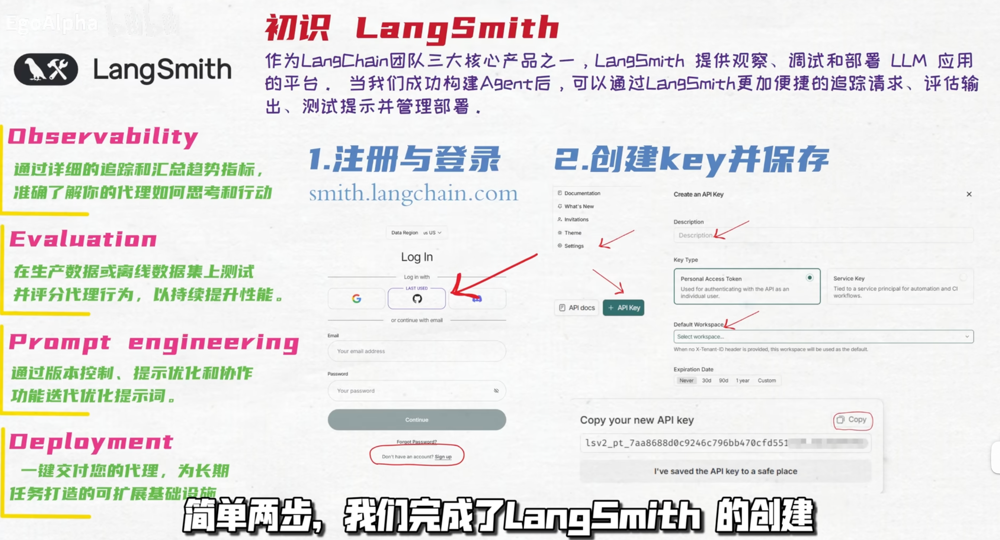
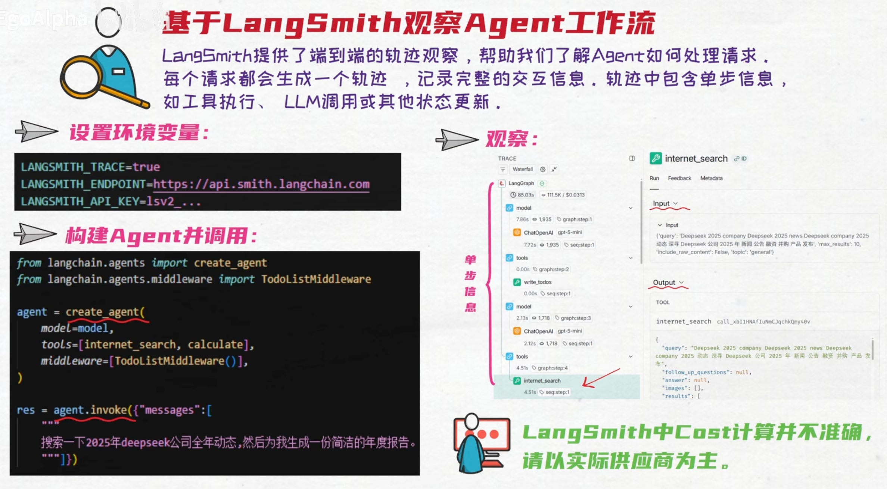
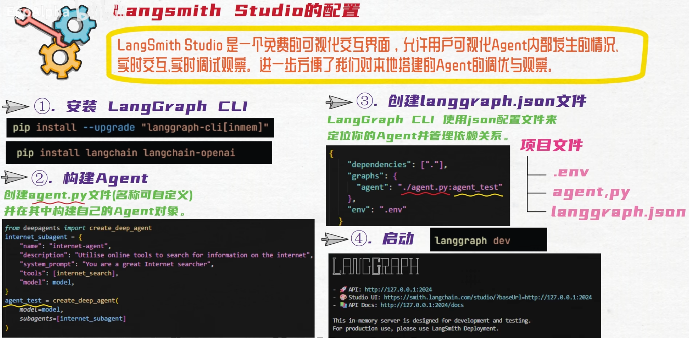
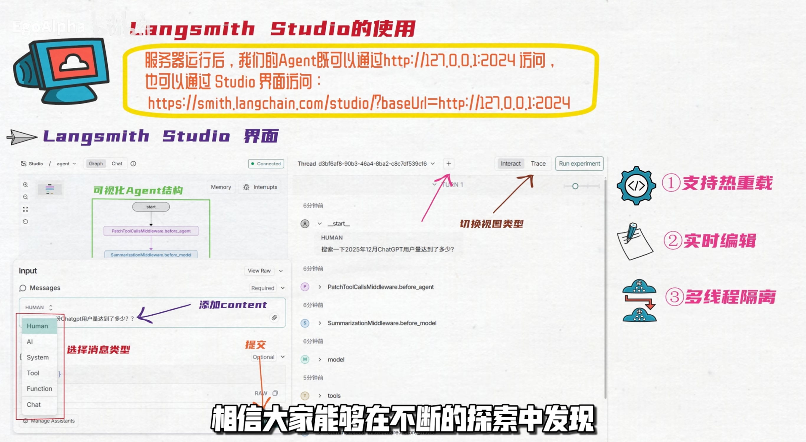

# ai-agent-langsmith

用 [LangSmith](https://www.langchain.com/langsmith) 观测 DeepAgent 的最小示例。

本项目只包含一个入口文件 `src/index.ts`：创建一个基于 Anthropic 兼容接口的 `deepagents` Agent，向其提问一次"什么是 LangSmith?"。通过 `.env` 打开 LangSmith 追踪后，这轮完整的 **模型调用 → 思考 → 工具规划 → 回答** 链路会自动上报到 LangSmith，方便观察每一步的输入输出、耗时与 Token 消耗。

> 与 `ai-agent-langsmith-demo`（LangGraph.js 项目模板，侧重 LangGraph Server / Studio）相比，这里侧重展示"零侵入"接入：不需要改动任何调用代码，只要配置环境变量即可把 LangChain 系可运行对象自动 trace 到 LangSmith。

## 环境变量

参考 `.env.example` 复制为 `.env`：

```dotenv
# ---- LangSmith 追踪 ----
LANGSMITH_TRACING=true                              # 开启追踪
LANGSMITH_ENDPOINT=https://api.smith.langchain.com  # LangSmith 云服务地址
LANGSMITH_API_KEY=lsv2_...                           # LangSmith API Key
LANGSMITH_PROJECT="随便写"                            # 项目名，用于在 LangSmith 中分组

# ---- 模型配置（Anthropic 兼容接口）----
ANTHROPIC_API_KEY=你的密钥
ANTHROPIC_BASE_URL=https://api.anthropic.com        # 或你的代理/中转地址
MODEL=claude-sonnet-4-5                              # 填入实际使用的模型 ID
```

说明：

- 开启追踪的开关是 `LANGSMITH_TRACING=true`；`deepagents` 创建的 Agent 属于 LangChain `Runnable`，只要该变量存在就会被 LangChain 的 LangSmith callback 自动捕获，无需改动代码。
- 模型使用 `ChatAnthropic` 且支持 `ANTHROPIC_BASE_URL`，可指向 Anthropic 官方接口或 OpenAI 兼容代理。
- 代码用 `zod` 校验上述三个模型环境变量，缺一会在启动时报错（因为 tsconfig 开启了 `exactOptionalPropertyTypes`）。

## 快速开始

```bash
# 1. 安装依赖
pnpm install

# 2. 直接运行 TypeScript 入口（需要较新的 Node，支持直接执行 TS）
node src/index.ts

# 如果本地 Node 版本较旧，可自行安装 tsx 后运行：
# pnpm add -D tsx && pnpm exec tsx src/index.ts
```

运行后会在终端输出 Agent 对"什么是 LangSmith?"的回答。若 `.env` 已配置好 LangSmith，打开 LangSmith 控制台，在对应 `LANGSMITH_PROJECT` 下即可看到这次运行生成的 trace。

## 项目结构

```
ai-agent-langsmith
├── .env / .env.example   # LangSmith 与模型相关环境变量（模板见 .env.example）
├── package.json
├── tsconfig.json         # NodeNext + strict + exactOptionalPropertyTypes
└── src
    └── index.ts          # 创建 ChatAnthropic 模型 + createDeepAgent，invoke 一次并打印结果
```

## 提示

- 每次运行都会生成一条新 trace；重复运行多次可对比不同模型 / 不同 prompt 的效果。
- 若没有 LangSmith 账号，也可把 `LANGSMITH_TRACING` 置为 `false`，此时本项目仅作为一个普通的 DeepAgent 调用示例。
- 想追踪多轮 / 带自定义工具的 Agent，参考同一组目录下的 `ai-agent-deepagent-demo`。






